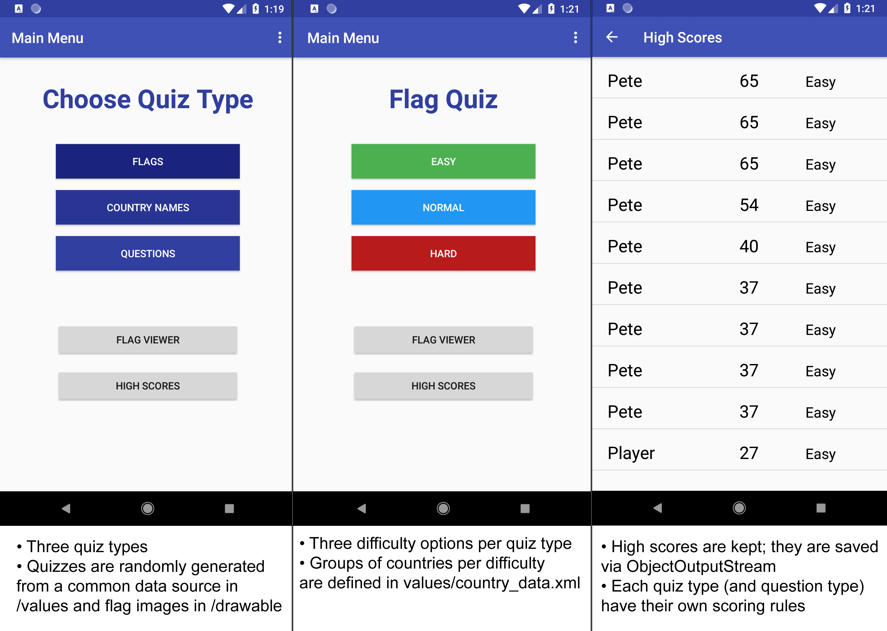
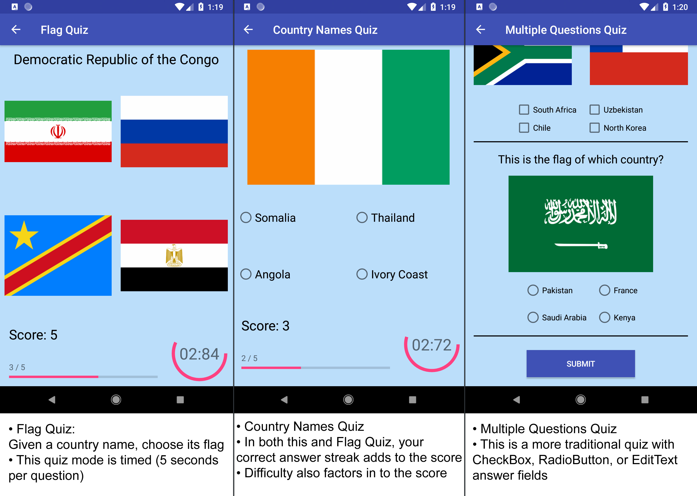

This is my third project for the Udacity Grow With Google Challenge Course.

App features:
<ul>
<li>Flags are randomly selected from a database of all countries (defined in country_data.xml)</li>
<li>Three quiz types</li>
<li>Three difficulty levels which can be easily redefined in values/country_data.xml</li>
<li>Scorekeeping which rewards you for difficulty level and number of correct answers in a row (streak)</li>
<li>A custom adapter, HighScoreItemAdapter, which is used to dynamically display the top 10 high scores</li>
<li>The app uses Shared Preferences to remember whether this is its first run or not. If it is, it fills the high score board with dummy data (currently "Bob, 0 points, Unknown difficulty").</li>
<li>A custom class, HighScoreItem. This implements Serializable which facilitates easy saving and loading.</li>
<li>The app saves and loads its high scores array using ObjectOutputStream & ObjectInputStream which automatically serializes the HighScoreItem objects.</li>
<li>A custom, circular progress bar. This is defined in drawable/circular.xml. See the TimerDevelopmentActivity for more details about this.</li>
<li>The Multiple Questions quiz type uses Fragments to dynamically generate its quiz form. The fragments are able to persist across screen rotations without losing their data</li>
</ul>

I used flag images from https://github.com/emcrisostomo/flags   
The app uses two-letter country codes to refer to each country internally. I used a combination of country code data from a few different sources and tidied it up in Excel. I also used Excel to tag my data such as "\<item\>East Timor\</item\>" so that I could copy-paste the whole list into country_data.xml at once.

You can see it in action here: https://www.youtube.com/watch?v=iSi4KL5zDYQ?version=3&vq=hd720

  

